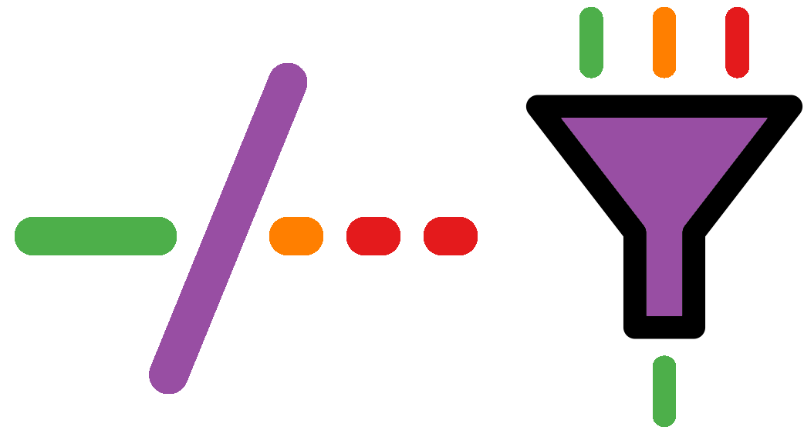
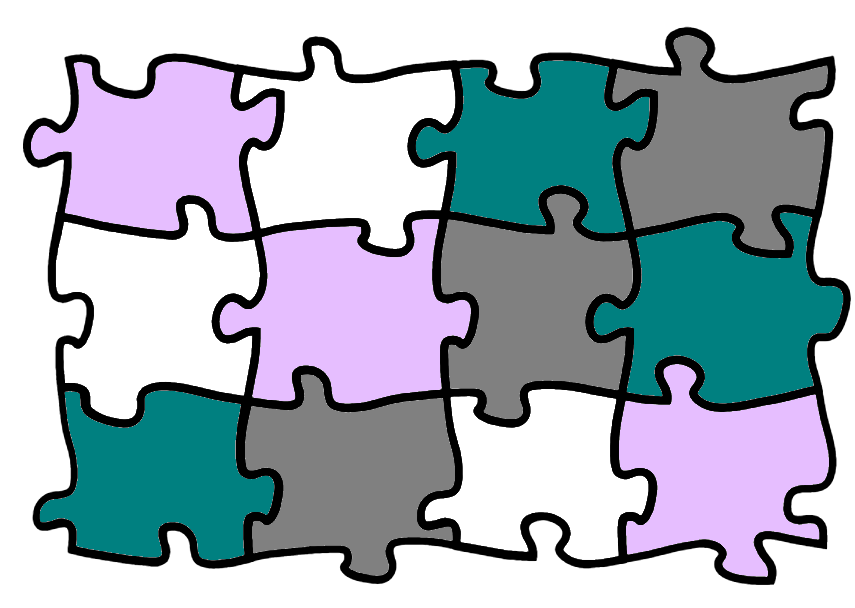

```{r cite-packages, include = FALSE}
# automatically create a bib database for R packages
# add any packages you want to cite here
knitr::write_bib(c(
  .packages(), 'bookdown', 'webexercises'
), 'packages.bib')
```

```{r, echo=FALSE}
#Change colour, border, and text of code chunks
#Check style.css for .Rchunk
#https://stackoverflow.com/questions/65627531/change-r-chunk-background-color-in-bookdown-gitbook
#https://bookdown.org/yihui/rmarkdown-cookbook/chunk-styling.html
knitr::opts_chunk$set(class.source="Rchunk")
```

<center>
{style="width:300px"}
</center>

# Introduction

<center>
{style="width:200px; background: white; border-radius:5px"}
</center>

There are many unknown and unculturable microbes found in a vast array of different environments. Shotgun metagenomics is an approach to capture all the genetic information in a sample, providing the taxonomic and metabolic information of all present organisms. In this course we will analyse shotgun metagenomic sequencing data from stool samples to compare Western and Korean diets.

Sessions will start with a brief presentation followed by self-paced computer practicals guided by this online interactive book. This book will contain theory and practice code. Multiple choice questions will guide the interpretation of results.

At the end of the course learners will be able to:

-   Carry out quality control of sequencing data, including host removal.
-   Explain how Kraken2 utilises <u id='kmer'>k-mers</u> to taxonomically classify sequence data.
-   Quantify taxonomic composition of shotgun metagenomic data with Kraken2 & Bracken.
-   View taxonomic abundances with Krona.
-   Utilise LEfSe for biomarker detection.
-   Profile the microbial pathways in metagenomic sequencing data with the bioBakery suite of tools, including HUMAnN.
-   Perform a metagenome assembly with MEGAHIT, and assess it with QUAST.
-   Carry out genomic binning of the metagenome assembly with MetaBAT2 to try to separate the different species present into Metagenome Assembled Genomes (<u id='mag'>MAGs</u>).
-   Assess the quality, completeness, and contamination levels of MAGs with CoCoPyE.
-   Functional annotation of the bins with Bakta.

## Table of contents {.unnumbered}

```{r, echo=FALSE, align="centre"}
#Create 2 column dataframe
column_1 <- c(
  #1 Overview
  '[**Overview**](#overview)', 
 '[{style="height:150px; border-radius:15px; border: white 5px solid; background:white"}](#overview)',
 #3 Trimming data
    '[**Trimming data**](#qualcont)', 
 '[{style="height:150px; border-radius:15px; border: white 5px solid; background:white"}](#qualcont)',
 #5 Taxonomic profiling
   '[**Taxonomic profiling**](#taxprofile)', 
 '[{style="height:150px; border-radius:15px; background:white"}](#taxprofile)',
 #7 Metagenome assembly
   '[**Metagenome assembly**](#metagenomeassembly)', 
 '[{style="height:150px; border-radius:15px; border: white 5px solid; background:white"}](#metagenomeassembly)',
  #9 Functional annotation
   '[**Functional annotation**](#funcanno)', 
 '[{style="height:150px; border-radius:15px; background:white"}](#funcanno)'
)
column_2 <- c(
  #2 Raw data
  '[**Raw data**](#rawdata)', 
 '[{style="height:150px; border-radius:15px; border: white 5px solid; background:white"}](#rawdata)',
 #4 Host removal
   '[**Host removal**](#hostremoval)', 
 '[{style="height:150px; border-radius:15px; background:white"}](#hostremoval)',
 #6 Functional profiling
   '[**Functional profiling**](#functprofile)', 
 '[{style="height:150px; border-radius:15px; border: white 5px solid; background:white"}](#functprofile)',
 #8 Binning
   '[**Binning**](#binning)', 
 '[{style="height:150px; border-radius:15px; background:white"}](#binning)',
   #10 Appendix
   '[**Appendix**](#mamba-installs)', 
 '[{style="height:150px; border-radius:15px"}](#mamba-installs)'
)
table_df <- data.frame(column_1, column_2)
#Kable and kableextra libraries
library(knitr)
library(kableExtra)
#Create table
#ALign both column in centre (align = "cc")
table_df %>%
  kbl(align= "cc", col.names = NULL) %>%
  kable_styling(position = "center")
```


```{r, echo=FALSE}
#Tippy tooltips
#Note, &#013; is a newline entitiy (\n does not work)
tippy::tippy_this(elementId = "kmer", 
                  tooltip = "K-mers are substrings of length k within a DNA/RNA sequence. 
                              The 1-mers of 'AGCT' are 'A', 'G', 'C', and 'T'. 
                              Its 2-mers are 'AG', 'GC' and 'CT'. 
                              Its 3-mers are 'AGC' and GCT'. 
                              Its 4-mer is 'AGCT'.",
                  arrow = TRUE, placement = "bottom")
tippy::tippy_this(elementId = "mag", 
                  tooltip = "Metagenome-Assembled Genome",
                  arrow = TRUE, placement = "bottom")
```

<a rel="license" href="http://creativecommons.org/licenses/by-nc-sa/4.0/"></a><br />This work is licensed under a <a rel="license" href="http://creativecommons.org/licenses/by-nc-sa/4.0/">Creative Commons Attribution-NonCommercial-ShareAlike 4.0 International License</a>.
