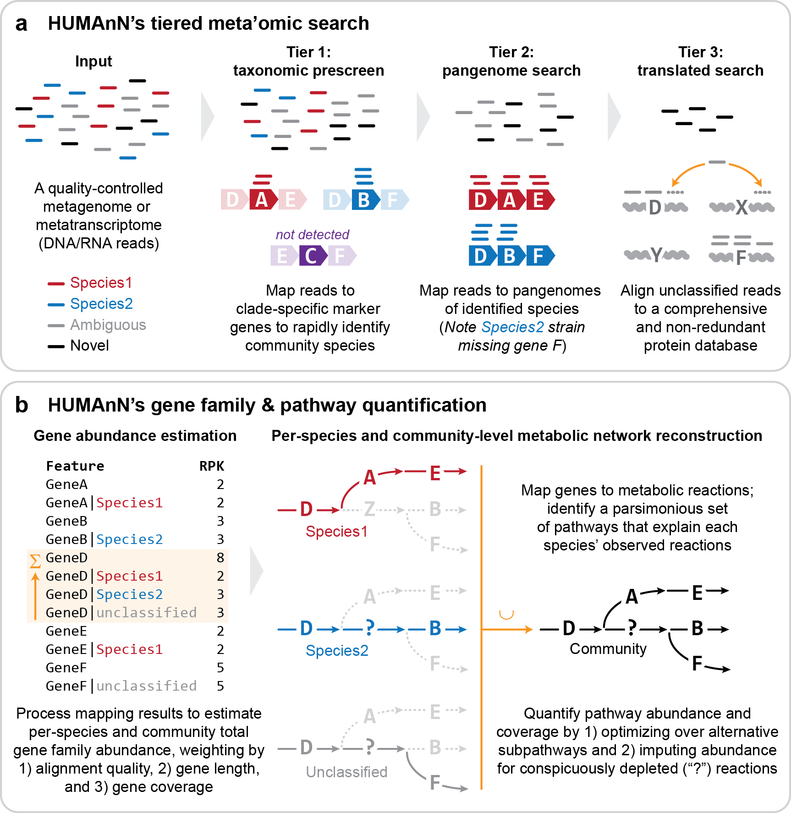
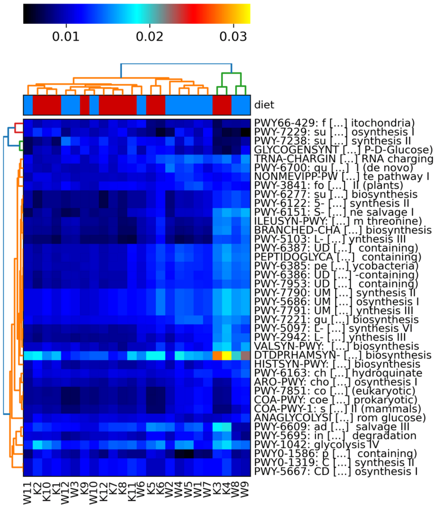

# (PART\*) Functional profiling of reads {.unnumbered}

# HUMAnN Functional profiling {#functprofile}
<center>
{style="width:150px; background:white;border-radius:5px"}
</center>

It is possible to investigate functional differences between metagenome (and metatranscriptome) samples by directly interrogating the read data. We will look at how this can be done with a package called `HUMAnN` (The HMP Unified Metabolic Analysis Network), a [bioBakery](https://github.com/biobakery/biobakery) pipeline designed to accurately profile the presence/absence and abundance of microbial pathways in metagenomic sequencing data.

`HUMAnN` is on its third version and was developed in tandem with the third version of `MetaPhlAn`, a computational tool for profiling the composition of microbial communities from metagenomic data.

Please see below for a diagram showing the pipeline of `HUMAnN`:

<center>
{style="width: 750px; border-radius: 15px"}
</center>

`r hide("HUMAnN 4")`
HUMAnN 4 is currently in alpha: (https://forum.biobakery.org/t/announcing-humann-4-0-alpha/7531)
I have tested it and could not install it correctly so we will not be teaching its use in this course till it is out of alpha and stable.
`r unhide()`

## HUMAnN
<center>
{style="width:150px; background:white;border-radius:5px"}
</center>

First, we will carry out an example run of the software and briefly explore the output files. `HUMAnN` can take a long time to run so we will use a small amount of example data. Additionally, we will use a subset of the `HUMAnN` databases for the analysis but when running analysis on your own data you should use the full databases. Information on installing `HUMAnN` and its databases can be found on its online [Home Page](https://huttenhower.sph.harvard.edu/humann/).

### HUMAnN: mamba, directories, and files
<center>
{style="width:200px; border-radius:5px"}
</center>

We need a new `mamba` environment. Open a new terminal (right click on the main screen background, choose `Terminal`) and run the below:

```{bash eval=FALSE}
. usebiobakery3.9
```

Make a new directory and move into it.

```{bash eval=FALSE}
mkdir ~/4-FunctionalProfiling
cd ~/4-FunctionalProfiling
```

Copy over some test data we will carry out the analysis on. This is a demonstration FASTQ file that we will use. It will be small enough to run `HUMAnN` in a reasonable amount of time.

```{bash eval=FALSE}
cp /pub14/tea/nsc206/NEOF/Shotgun_metagenomics/humann/demo.fastq.gz .
```

### HUMAnN: run
<center>
{style="width:100px"}
</center>

Run the `HUMAnN` pipeline with our demo data:

```{bash eval=FALSE}
humann \
--input demo.fastq.gz \
--output demo.humann \
--threads 10
```

Here, we are telling the software to use `demo.fastq.gz` as input and to create a new output directory called `demo.humann` where the results will be generated.

As the software runs you might notice that `HUMAnN` runs `MetaPhlAn`. The purpose of this is to identify what species are present in the sample, so `HUMAnN` can tailor generate an appropriate database of genes (from those species) to map against. It will carry out this alignment against the gene database, then a protein database, and finally compute which gene families are present. `HUMAnN` will determine which functional pathways are present and how abundant they are.

If you are using paired end reads the `HUMAnN` developers recommend concatenating your reads into one file and running `HUMAnN` on the concatenated file [source](https://forum.biobakery.org/t/humann3-paired-end-reads/862/3).

For example (don't run the below):

```{bash, eval=FALSE}
cat K1_R1.fq.gz K1_R2.fq.gz > K1.fq.gz
humann --input K1.fq.gz --output humann_output --threads
```

### HUMAnN: output
<center>
{style="width:100px"}
</center>

Once the run has completed, change into the newly created output directory and list the files that are present.

```{bash eval=FALSE}
cd demo.humann
ls
```

You will see that there are three files and one directory. The directory (`demo_humann2_temp`) contains intermediate temporary files and can be disregarded here.

The three output files are:

-   **`demo_genefamilies.tsv`**: A table file showing the number of reads mapping to each UniRef90 gene family. Values are normalised by the length of each gene family (i.e. RPK, or Reads per Kilobase). Additionally, the values are stratified so that they show the overall community abundance but also a breakdown of abundance per species detected. This allows researchers to delve into species specific functions, rather than only looking at the metagenomic functions as a whole,
-   **`demo_pathabundance.tsv`**: A table file showing the normalised abundance of MetaCyc pathways (RPKs). These abundances are calculated based on the UniRef90 gene family mapping data and are also stratified by species.
-   **`demo_pathcoverage.tsv`**: A table file that shows the coverage, or completeness, of pathways. For example, a pathway may contain 5 components (or genes/proteins)
    -   Pathway1 : A → B → C → D → E 100% complete
    -   A species identified in the sample may only have four of the components, meaning that the pathway is only 80% complete (represented as 0.8)
    -   Pathway1 : A → B → C → ~~D~~ → E 80% complete

The basic format of these three output files is the same, so let's take a look at the pathway abundance table.

```{bash eval=FALSE}
less demo_pathabundance.tsv
```

You will see that there are two columns:

1.  The first column shows the pathways.
    -   **UNMAPPED** indicates reads that could not be aligned.
    -   **UNINTEGRATED** indicates reads that aligned to targets not implicated in any pathways.
2.  The second column shows the abundance.

This file is not too interesting to look at as it is only demo data. Therefore, press `q` to exit `less` and let's look at some real data.

**Note**: The directory `demo_humann2_temp` can be very large and so should be deleted in real projects once you are certain they are not needed. However, these files can be useful for debugging.

**Note**: Link to more detail on [Output files](https://github.com/biobakery/humann#output-files)

## Multi sample processing {#humannmultisampleprocessing}
<center>
{style="width:150px"}
</center>

Looking at the functional profile of one sample in isolation is usually not very informative. First, there is nothing to compare it to and second, there are no biological replicates. We will therefore use all the Korean and Western diet samples.

It would take many hours to analyse all of the data using `HUMAnN` and is outside the scope of this course. For this reason, samples were analysed prior to the workshop to generate the output files we covered above.

For the purposes of this comparison, we will look at the pathway abundances only. First copy over the data directory containg the gene families tables and have a look in it.

```{bash eval=FALSE}
#Ensure you are in the correct directory
cd ~/4-FunctionalProfiling
#Copy directory with pre made results
cp -r /pub14/tea/nsc206/NEOF/Shotgun_metagenomics/DietPathAbundance .
#Move into the copied directory
cd DietPathAbundance
#List files
ls
```

You will see there are 12 files prefixed with K and 12 prefixed with W, for the Korean diet and Western diet samples, respectively. Take a look at the file for K1.

```{bash eval=FALSE}
less K1_pathabundance.tsv
```

There are a lot of pathways in the file. Quit out of the `less` viewer (`q`) and look at the entries for one specific pathway, COA-PWY-1 (a coenzyme A biosynthesis II pathway).

```{bash eval=FALSE}
grep COA-PWY-1 K1_pathabundance.tsv | less
```

This shows 30 entries/lines with the top entry/line:

**`COA-PWY-1: superpathway of coenzyme A biosynthesis III (mammals)        6790.1517478104`**

This shows the abundance of the pathway across the entire sample (6790.1517478104).

The other entries show the species stratification information (mentioned above) of the pathway. I.e. the second line:

**`COA-PWY-1: superpathway of coenzyme A biosynthesis III (mammals)|g__Bacteroides.s__Bacteroides_dorei    1292.7711872228`**

shows the abundance of the pathway that is contributed by the species *Bacteroides dorei* (1292.7711872228).

**Note**: The species stratified pathway abundances may not equal the total community pathway abundance. Please see this [forum post](https://forum.biobakery.org/t/humann3-pathway-abundance-table-pathway-sum-and-species-sum-different/1471) for details.

With this information we will carry out some comparisons including biomarker detection to determine which pathways are differentially abundant between the Western diet and Korean diet samples.

**Note**: The following methods/pipeline can be used for the genefamilies and pathcoverage tables in your own future analyses.

### HUMAnN: combining data
<center>
{style="width:100px; background:white; border-radius:5px"}
</center>

First, we need to combine these 24 tables into one large results table. `HUMAnN` provides a tool to do this:

```{bash eval=FALSE}
#Change directory to main Functional profiling directory
cd ~/4-FunctionalProfiling
#Join the tables
humann_join_tables --input DietPathAbundance/ --output diet.tsv
```

This command will look for all tables in the `DietPathAbundance` directory and generate a large, 25 column table called `diet.tsv`. You can inspect the file to ensure that this has worked correctly.

```{bash eval=FALSE}
less -S diet.tsv
```

### HUMAnN: split stratified table
<center>
{style="width:100px; background:white; border-radius:5px"}
</center>

For this tutorial we do not want the species stratification information. We will therefore split the table to create 2 new files:

-   `diet_unstratified.tsv`: This table only contains the total abundance values for the pathways. It does not contain any species stratification information.
-   `diet_stratified.tsv`: This table only contains the species stratification abundance values for the pathways. It does not contain the total abundance information.

To create the split files and output them to your current directory, run the following command:

```{bash eval=FALSE}
humann_split_stratified_table --input diet.tsv --output .
```

We will use the file `diet_unstratified.tsv` for our downstream analysis.

Before you move on feel free to inspect the output files with the `less` command.

**Note**: You can use any of the three tables (unsplit table, unstratified table, or stratified table) in your own analysis. This depends on your question and data.

### HUMAnN: renormalising data {#humannrenormalise}
<center>
{style="width:100px; background:white; border-radius:5px"}
</center>

The next step is to renormalise the data. Currently, all of the abundance values are only normalised within each sample (RPKs). However, they are not normalised between samples, and this is very important to do. For example, if we had sequenced two samples, A and B, and we obtained 5 million reads for sample A and 20 million reads for sample B, without normalisation, it might look that there was up to 4x as much functional activity in sample B!

To correct for this, we normalise the abundance values based on the number of reads in each sample. We will normalise to relative abundance (`--units relab`) where all abundances for each sample add up to 1.

Renormalisation command:

```{bash eval=FALSE}
humann_renorm_table \
--units relab \
--input diet_unstratified.tsv \
--special n \
--output diet_unstratified.relab.tsv
```

This command generates the normalised data in the new table `diet_unstratified.relab.tsv`. The `--special n` option tells the script to remove all unmapped and unassigned values (**UNMAPPED** & **UNINTEGRATED**) from the table.

**Note:** With the gene families information ensure you normalise by CPM (counts per million) with the option `--units cpm`. More info can be found on the [Normalizing RPKs to relative abundance](https://github.com/biobakery/biobakery/wiki/humann3#31-normalizing-rpks-to-relative-abundance) section of the HUMAnN 3.0 tutorial.

## Heatmap
<center>
{style="width:150px; background:white; border-radius:5px"}
</center>

Now that we have our combined, unstratified, and normalised table, we can visualise the dataset to see how the two groups compare.

-   Do samples in the same diet group appear to correlate well with each other?
-   Are samples from one diet group distinguishable from those from the other diet group?

To visualise this we will create a heatmap with `hclust2`.

Before carrying out the command we will need to edit the file. Carry out the following alterations:

Remove the `_Abundance` part of the sample names whilst creating a copy that we will use (It is always a good idea to keep the original file in case a mistake happens).

```{bash eval=FALSE}
cat diet_unstratified.relab.tsv | sed "s/_Abundance//g" > diet_unstratified.relab.comp.tsv
```

**Intro to unix links**:

-   [Text editing with **`sed`**](http://www.cgr.liv.ac.uk/illum/NEOFworkshops_5bfa93ca0482d69d/Intro_to_Unix/12-Advanced_linux_practice.html#sed)
-   [Redirection with **`>`**](http://www.cgr.liv.ac.uk/illum/NEOFworkshops_5bfa93ca0482d69d/Intro_to_Unix/12-Advanced_linux_practice.html#redirection)

Next using your text editor of choice carry out the following changes on the file `diet_unstratified.relab.comp.tsv`.

-   Remove the `#` (including the one space after the `#`) from the start of the header so it starts as `Pathway`.
-   Add in the same metadata line as we did for [12.1](#kraken2_lefse_metadata) but this time below the header line, i.e. as the 2nd line (ensure you are using tabs instead of spaces).

`r hide("Issues with creating file?")` If you are having issues with creating and editing the file `all_num.lefse.bracken` you can copy a pre-made version.

```{bash, eval=FALSE}
cp /pub14/tea/nsc206/NEOF/Shotgun_metagenomics/lefse/diet_unstratified.relab.comp.tsv .
```

`r unhide()`

Now we can use the `hclust2` tool to create a heatmap of our pathway abundances.

```{bash eval=FALSE}
hclust2.py \
-i diet_unstratified.relab.comp.tsv \
-o diet_unstratified.relab.heatmap.png \
--ftop 40 \
--metadata_rows 1 \
--dpi 300
```

**Note:** You will get 2 `MatplotlibDeprecationWarnings`, these are normal and can be ignored. However, ensure these are the only warnings/errors before continuing.

#### Parameters {.unnumbered}

-   `-i`: The input table file.
-   `-o`: The output image file. The tool does not specify what types of image files you can use but `.png` is always a good image file format.
-   `--ftop`: Specifies how many of the top features (pathways in this case) to be included in the heatmap.
-   `--metadata_rows`: Specifies which row/s contain the metadata information to be used for the group colouring at the top of the heatmap.
    -   Row numbers start at 0 for this tool. Therefore our sample names are in row 0 and the diet info is in row 1.
    -   Multiple rows can be specified if you have multiple rows of metadata.
        -   e.g. `--metadata_rows 1,2,3`.
-   `--dpi`: The image resolution in dpi (dots per inch). 300 dpi is used for publication quality images.

There are many more options that can be seen on the [hclust2 github](https://github.com/SegataLab/hclust2).

#### Visualise {.unnumbered}

Now we can view the plot.

```{bash eval=FALSE}
firefox diet_unstratified.relab.heatmap.png
```

From this, we can see that there is a small amount of clustering caused by the differences between the Korean and Western diet. Other factors that we do not know about the samples must also come into play. This is normal as we cannot account for everything but it is good to try to account for as much as possible.

<center>
{style="border-radius: 15px; width: 750px; border: 5px solid white"}
</center>

#### MCQs {.unnumbered}

```{r, echo = FALSE}
opts_p <- c("__ARO-PWY__",answer="__DTDPRHAMSYN__","__PWY-6385__")
```

1.  Which pathway stands out the most? `r longmcq(opts_p)`

```{r, echo = FALSE}
opts_p <- c("__1__",answer="__2__","__3__")
```

2.  How many clusters are formed based on diet (Colours on tree at top of heatmap)? `r longmcq(opts_p)`

```{r, echo = FALSE}
opts_p <- c("__1__","__2__",answer="__3__")
```

3.  How many clusters are formed based on pathways (Colours on tree at the side of heatmap)? `r longmcq(opts_p)`

You can look up the pathway names in the table file to see a fuller description.

## LEfSe {#humann_lefse}
<center>
{style="width:150px"}
</center>

For the final part of this section, we will see if there are any statistically significant differences between the two sample groups. There are several ways in which this can be achieved but we will carry out `LEfSe` again.

**Task**: Go back to your `shotgun_meta` terminal (or create a new one and use `. useshotgun`). Then change directory to `4-FunctionalProfiling`)

Thankfully we already formatted the file to work with `LEfSe` when we formatted it for `hclust2`

```{bash eval=FALSE}
#LEfSe format
lefse_format_input.py \
diet_unstratified.relab.comp.tsv \
diet_unstratified.relab.comp.lefse \
-c 2 -u 1 -o 1000000
#Run LEfSe
lefse_run.py \
diet_unstratified.relab.comp.lefse \
diet_unstratified.relab.comp.lefse.out
#Produce LEfSe plot
lefse_plot_res.py \
--dpi 200 \
--format png \
#Below options added to increase max length of feature string
--max_feature_len 200 \
diet_unstratified.relab.comp.lefse.out \
diet_unstratified.relab.comp.lefse.png
#View plot
firefox diet_unstratified.relab.comp.lefse.png
```

Look at the output and see what pathways count as biomarkers for the 2 groups.

## Optional task

Carry out all the steps starting from [Multi sample processing](#humannmultisampleprocessing) with the gene families information.

-   Copy the gene families data from `/pub14/tea/nsc206/NEOF/Shotgun_metagenomics/DietGeneFamilies`
-   Ensure you set the `--units` option to `cpm` in the [renormalising data](#humannrenormalise) step.
-   On top of analysing the unstratified data you can also analyse the stratified data.

That completes the non assembly approach to shotgun metagenomic analysis. The next chapters will cover an assembly approach.
