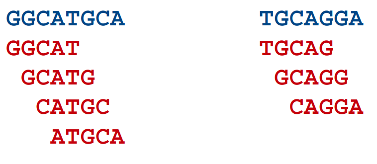

# (PART\*) Assembly Approach {.unnumbered}

# Metagenome assembly {#metagenomeassembly}

{style="width:300px; background: white; border-radius:5px"}

So far we have directly analysed the read data itself which is perfectly fine for taxonomic profiling and for certain methods of functional profiling. However, Illumina reads are generally short and therefore can not provide us with much data on larger constructs that are in the metagenomic samples, e.g. genes. While it is possible to predict from which gene a sequence read might originate, the short nature of the query can sometimes lead to ambiguous results.

Additionally, depending on the application it can become computationally intensive to analyse large numbers of reads. Here, we are only using samples with 1 million reads. Some metagenome samples consist of 50-100 million+ read pairs. If such a sample belonged to a set of 100 samples, that would be up to 10 billion read pairs, or 2 trillion bases of sequence data, with many of these being redundant.

For this reason, it is sometimes advantageous to assemble the reads into contigs, using a meta-genome assembler. This has the dual effect of:

-   Reducing the overall size of the data for analysis. If a metagenome was sequenced at 50x depth, then by assembling it you could theoretically reduce the amount of sequence to analyse by 50-fold.
-   Increase the size of the fragments you will analyse. This is the main advantage of an assembly, as the \~100 bp reads can be pieced together to form 100,000 kb+ contigs. These contigs will contain complete genes, operons and regulatory elements: Reconstructed genome sections.

Here, we will carry out a couple of assemblies on our dataset.

## Metagenome assembly: Mamba

{style="width:200px; border-radius:5px"}

We will use the `shotgun_meta` conda environment so use a terminal where this is activated or open a new one and run `. useshotgun`.

## A primer on short read assembly

{style="width:150px; background: white; border-radius:5px; border: white solid 5px"}

Illumina reads are too short and numerous to use traditional overlap-layout-consensus assemblers as such an approach would be far too computationally intensive. Instead, we use De Bruijn graph based assemblers. Briefly, these operate as follows:

1.  All reads are broken down into k-length overlapping fragments (k-mers). e.g. if we choose a k-mer size of 5 bp, the following two sequences (blue) would be broken down into the k-mers below them (red):

{style="border-radius: 10px; width: 400px"}

2.  All k-mers are linked to other k-mers which match with a k-1 length overlap (i.e. that overlap by all but one base):

{style="border-radius: 10px; width: 800px"}

3.  Paths are routed through the graph and longer contigs are generated:

{style="border-radius: 10px; width: 800px"}

The example here is a vast oversimplification of the complexity of a De Bruijn graph (i.e. there are no branches!). Routing through the graph is never as simple as this as some k-mers will lead to multiple k-mers, which can result in the break point of a contig. This is especially true for complex metagenomic data.

Generally speaking, the shorter the k-mer, the more branches there will be, the trickier the graph is to resolve, so the resulting contigs are smaller. Assemblers usually perform better with longer k-mer lengths but even then there might not be enough depth of sequencing to generate all k-mers that form overlaps, therefore leading to break points. Finding the right k-mer size usually involves testing several.

Fortunately, the assembler we will use, `MEGAHIT`, allows us to build an assembly using multiple k-mer lengths iteratively. The other great advantage about `MEGAHIT` is that it is quick and efficient. We will use `MEGAHIT` on our data soon, but first there is an additional processing step for our sequences...
