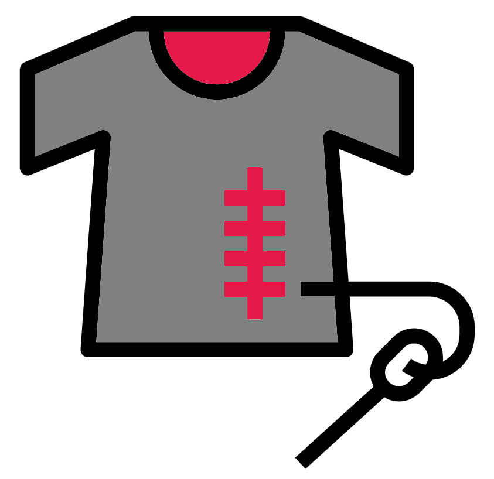

# Stitching read pairs
<center>
{style="width:150px; background: white; border-radius:5px; border: white solid 5px"}
</center>

Longer k-mers generally perform better for assemblies. However, our maximum read length is 100 bp so we are limited to a maximum k-mer length of 99 bp. Thankfully we can get even longer k-mers if we stitch our read pairs together.

__Note__: This method will not work if your reads have no overlap. If you are not sure if your reads have overlap ask the team who sequenced them.

A read pair consists of two sequences read from each end of a fragment of DNA (or RNA). If the two sequences meet and overlap in the middle of the fragment, there will be a region of homology. We can use this to merge the two reads together (See next image).

First, we obtain our forward and reverse reads, derived from different ends of the same fragment. Second, we look for sufficient overlap between the 3' ends of our sequences. Third, if there is sufficient overlap, we combine, or stitch, the two reads together to form one long sequence.

<center>
{style="width: 400px; border-radius: 15px; border: 5px solid white; background-color: white"}
</center>

Once we have longer stitched reads, we can increase the k-mer length for our assembly. 

There are a number of pieces of software that can be used to stitch reads (e.g. `Pear`,  `Pandaseq`) but today we will use one called `FLASH`:

## FLASH: run
<center>
{style="width:100px; background: white; border-radius:5px; border: white solid 5px"}
</center>

Make a new output directory for the stitched reads and run `FLASH`:

```{bash eval=FALSE}
#Change directory to home
cd ~
#Make and move into new directory
mkdir 5-Stitched
cd 5-Stitched
#Run flash
flash  -o K1 -z -t 12 -d . \
../2-Trimmed/K1_R1.fq.gz ../2-Trimmed/K1_R2.fq.gz
```

#### Parameters {-}
<center>
{style="width:100px; background: white; border-radius:5px; border: white solid 5px"}
</center>

- `-o`: Sets the prefix of the output files.
- `-z`: The input is zipped.
- `-t`: Number of threads to use.
- `-d`: The directory the output files will be placed.
- The last 2 flag-less parameters are the forward and reverse read files for stitching.

## FLASH: Output
<center>
{style="width:100px"}
</center>

Once `FLASH` has finished running, it will display on screen how well the stitching process went, in this case a low amount of reads were combined. Have a look what files have been generated.

```{bash eval=FALSE}
ls
```

We have three new fastq.gz files. One containing the stitched reads (`K1.extendedFrags.fastq.gz`) and two containing the reads from pairs that could not be combined (`K1.notCombined_1.fastq.gz` and `K1.notCombined_2.fastq.gz`).

We can also see what the new read lengths are:

```{bash eval=FALSE}
less K1.histogram
```

Scroll down with the down key and you will see that we are looking at a histogram showing the proportion of stitched reads at different lengths. 

## FLASH: MCQs
<center>
{style="width:100px; background: white; border-radius:5px; border: white solid 5px"}
</center>

```{r, echo = FALSE}
opts_p <- c("__101__", "__177__", answer="__188__")
```
1. What length has the highest proportion of stitched reads? `r longmcq(opts_p)`

```{r, echo = FALSE}
opts_p <- c(answer="__101__", "__177__", "__188__")
```
2. What length has the lowest proportion of stitched reads? `r longmcq(opts_p)`