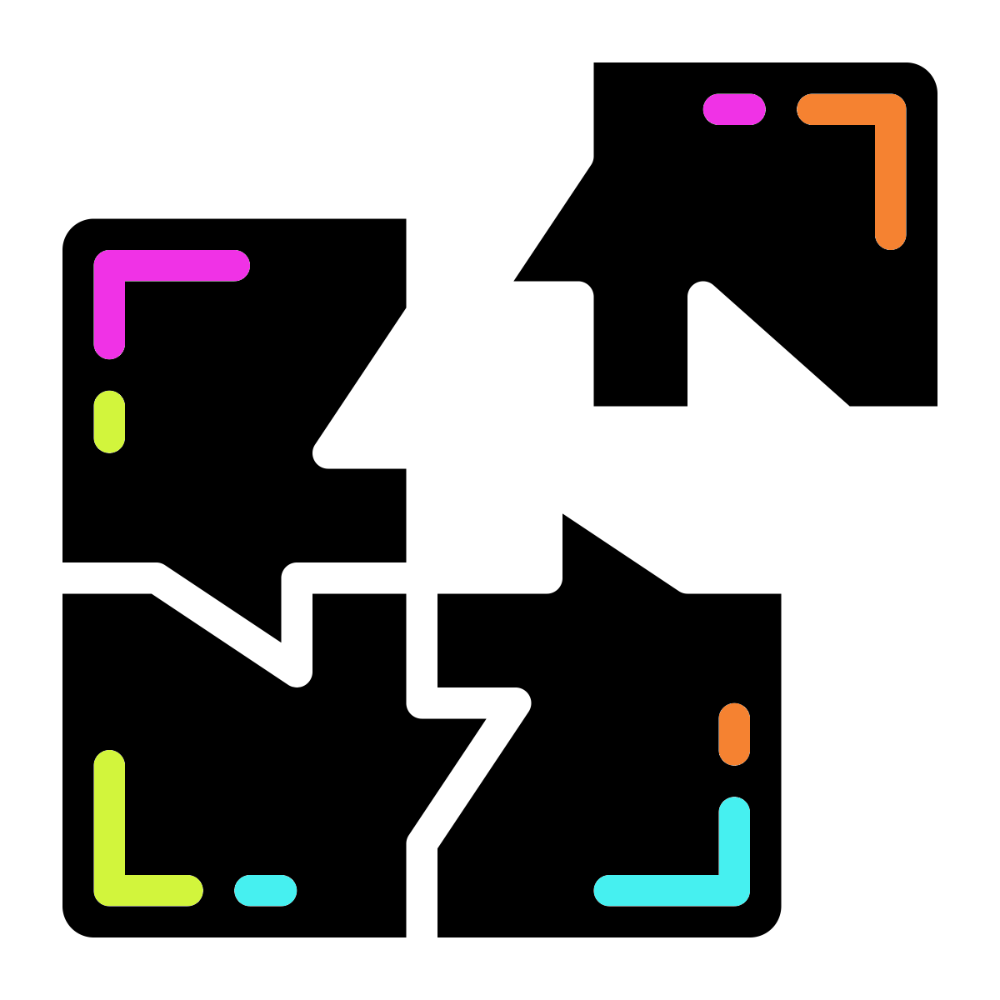

# Megahit Assembly
<center>
{style="width: 200px; border-radius: 15px; background-color: white"}
</center>

We will use our stitched and unstitched reads to produce an assembly with`MEGAHIT`. 

## MEGAHIT
<center>
{style="width:100px; background: white; border-radius:5px; border: white solid 5px"}
</center>

Create a new directory to store our assembly in. 

```{bash eval=FALSE}
cd ..
mkdir 6-Assembly
cd 6-Assembly
```

Now run the metagenome assembler `MEGAHIT` using our newly stitched read data.

```{bash eval=FALSE}
megahit \
-r ../5-Stitched/K1.extendedFrags.fastq.gz \
-1 ../5-Stitched/K1.notCombined_1.fastq.gz \
-2 ../5-Stitched/K1.notCombined_2.fastq.gz \
-o K1 \
-t 12 \
--k-list 29,49,69,89,109,129,149,169,189
```

#### Parameters {-}
<center>
{style="width:100px; background: white; border-radius:5px; border: white solid 5px"}
</center>

- `-r`: Single-end reads to be used for assembly. We are using our successfully stitched reads.
- `-1`: Forward reads of paired end reads to be used for assembly. We are using the reads that did not stitch as they still have useful information.
- `-2`: Reverse reads of paired end reads to be used for assembly. We are using the reads that did not stitch as they still have useful information.
- `-o`: Output directory.
- `-t`: Number of threads to be used for process.
- `--k-list`: K-mer list.

The __k-mer list__ instructs `MEGAHIT` to first generate an assembly using a k-mer size of 29 bp and when that is complete, integrate the results into an assembly using a k-mer size of 49 bp, and so on up to a final iteration using a k-mer size of 189 bp. This large range of k-mer lengths should give us a good assembly, given the data. However, it may take a while to run. This might be a good time to read on or take a break whilst the command runs. 

If you need a command prompt (your current one is busy because MEGAHIT is running), right click on the main screen, choose `Terminal`.

Once the assembly is completed, we can look at the output FASTA file containing the contigs:

```{bash eval=FALSE}
less K1/final.contigs.fa
```

There is not much to see. When happy, quit the `less` (`q`) and carry on to `QUAST`.

## QUAST
<center>
{style="width:150px; background: white; border-radius:5px; border: white solid 5px"}
</center>

We can generate some metrics based on the assembly with `QUAST`,  but first we will create a directory for the `QUAST` output.

```{bash eval=FALSE}
#Create QUAST output directory
#The option -p will create a directory and any required
#parent directories
mkdir -p quast/K1
```

### QUAST: run
<center>
{style="width:100px; background: white; border-radius:5px; border: white solid 5px"}
</center>

Now to run `QUAST`. 

```{bash eval=FALSE}
quast -o quast/K1 K1/final.contigs.fa
```

### QUAST: visualise
<center>
{style="width:100px; background: white; border-radius:5px; border: white solid 5px"}
</center>

`QUAST` will run relatively quickly. Once complete view the output with `firefox`.

```{bash eval=FALSE}
firefox quast/K1/report.html
```

The report tells us quite a bit about the assembly quality. Two definitions that you may not be aware of are __N50__ and __L50__. To calculate these values:

- Order the contigs from largest to smallest.
- Total up the sizes from biggest downwards.
- The contig we reach where our total is at least 50% of the size of the whole assembly is the N50 contig.
- __N50__ equals the length of the N50 contig. 
- __L50__ is the number of contigs with a length equal to or greater than N50.

<center>
{style="border-radius: 15px; width: 400px; border: 5px solid white"}
</center>

### QUAST: MCQs
<center>
{style="width:100px; background: white; border-radius:5px; border: white solid 5px"}
</center>

__Note:__ Due to the assembly process your values may be slightly different (< 1%). Please choose the closest value

```{r, echo = FALSE}
opts_p <- c("__39.88__", "__18,650__",answer="__16,187,259__")
```
1. What is the total length of the assembly? `r longmcq(opts_p)`

```{r, echo = FALSE}
opts_p <- c("__39.88__", answer="__18,650__","__16,187,259__")
```
2. How many contigs does the assembly consist of? `r longmcq(opts_p)`

```{r, echo = FALSE}
opts_p <- c(answer="__39.88__", "__18,650__","__16,187,259__")
```
3. What is the GC% of the assembly? `r longmcq(opts_p)`

```{r, echo = FALSE}
opts_p <- c(answer="__1,363__","__2,178__","__87,586__")
```
4. What is the N50 of the assembly? `r longmcq(opts_p)`

```{r, echo = FALSE}
opts_p <- c("__1,363__",answer="__2,178__","__87,586__")
```
5. What is the L50 of the assembly? `r longmcq(opts_p)`

```{r, echo = FALSE}
opts_p <- c("__1,363__","__2,178__",answer="__87,586__")
```
6. what is the length of the largest contig? `r longmcq(opts_p)`

__Questions__
- How do the contig metrics compare to the original reads? 

## Metagenome assembly summary
<center>
{style="width:100px; background: white; border-radius:5px; border: white solid 5px"}
</center>

We now have an assembly. It is not a brilliant one due to us only having used 1 million reads. In real analysis we would prefer fewer but longer contigs. We will explore some tools we can use with our metagenome assembly in the next chapters.

There is also a `metaQUAST` specifically for metagenome assemblies but it requires reference assemblies be provided.