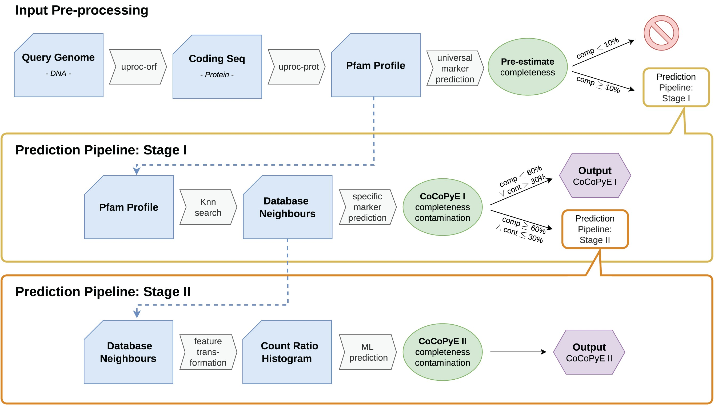
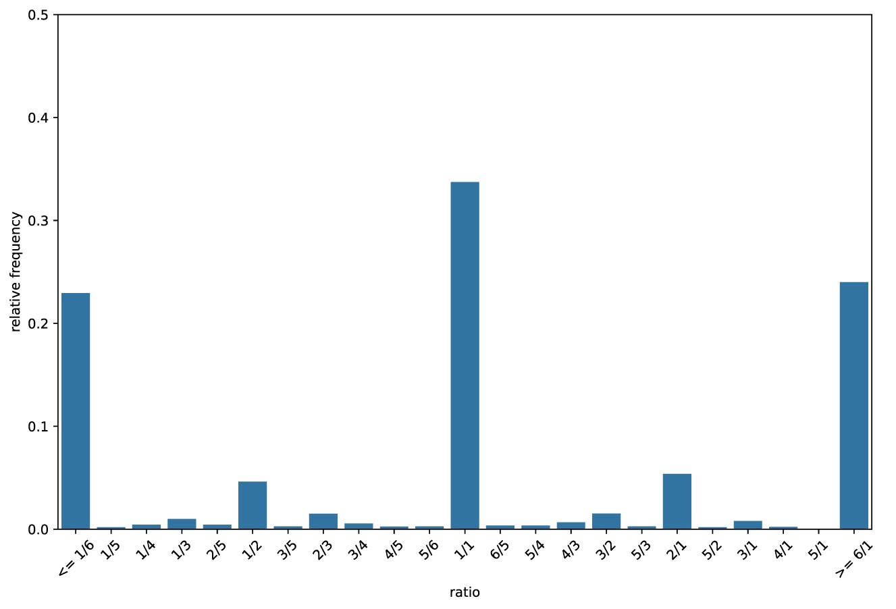
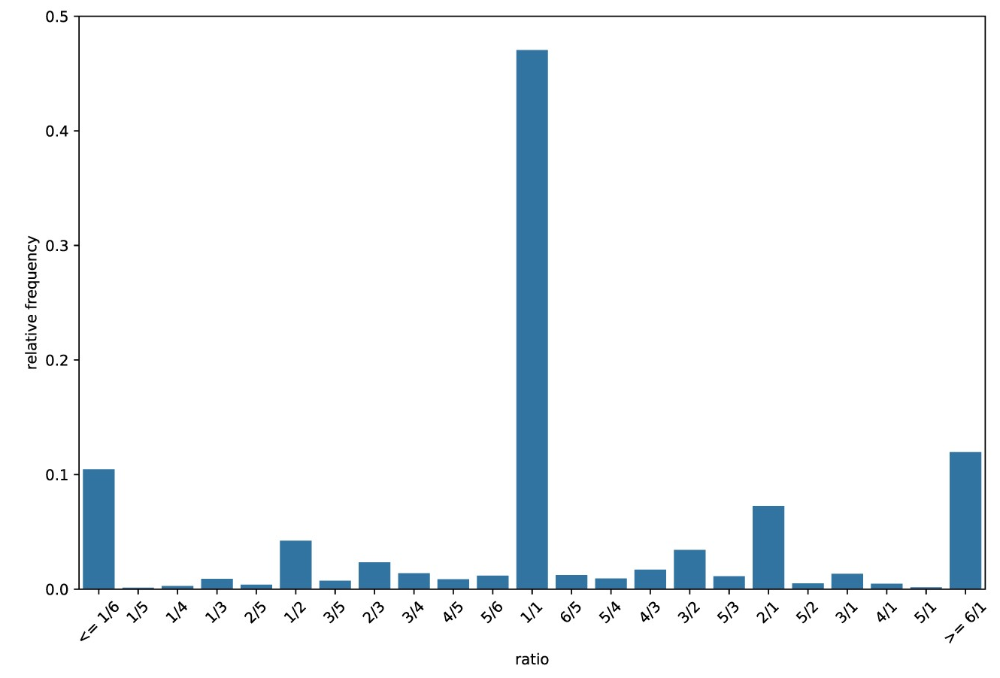

# Bin quality

<center>
{style="width: 400px; border-radius: 5px; background: white; border: white 5px solid"}
</center>

`CoCoPyE` is a useful tool to assess the quality of assembled microbial genomes. 
This can be used on assemblies produced from single cell, single isolate, or metagenome data. 

## Workflow concept

The tool utilises protein domain families from the Pfam database.
A protein domain is a region of a protein that folds independently from the rest and they vary in length from ~50-250 amino acids.
Many proteins consist of several domains and a domain can appear in many different proteins.

`CoCoPyE` estimates quality of a genome by estimating completeness and contamination through an input-preprocessing step followed by a two stage prediction step. 

Below is the workflow as a diagram followed by some quick information on how it works. 
For full details please see the CoCoPyE publication: https://academic.oup.com/gigascience/article/doi/10.1093/gigascience/giae079/7841111

<center>
{style="width: 800px; border-radius: 5px; border: white 5px solid"}
</center>

### Input Pre-processing

<center>
{style="width: 800px; border-radius: 5px"}
</center>

A protein domain search is carried out on all translated open reading frames of our our query genomes, MAGs/bins in our case.
The Pfam protein database is used and the tool produces protein domain counts for our query genomes.

Query genomes (MAGS/bins) with a completeness score <10% are rejected and removed from further analysis.

### Stage I
<center>
{style="width: 800px; border-radius: 5px"}
</center>

In Stage I the nearest neighbours of our query's protein domains are searched for in the Pfam database.
This creates a list of reference protein domains for our query.

Next a specific marker prediction is carried out to create the stage I (i.e. marker based) completeness & contamination values.
The Pfam database has information on which taxa these domains are present in.
Therefore, sets of domains can be used as markers for specific lineages.

#### Prediction example {-}

Let's go through a fictional example where we have 26 protein domains PDA-Z which cover 2 different lineages: Gigabacteria and Birthobacteria.

- Both Gigabacteria and Birthobacteria contain domains PDA-F
- Domains PDG-P are only present in Gigabacteria
- Domains PDQ-Z are only present in Birthobacteria

Analysis finds that our query genome contains the domain families PDD-R. 
We therefore acquire the below results:

- The query genome is classified as belonging to the Gigabacteria lineage as it contains many (in this case all) the domains unique to Gigabacteria (PDG-P) and many of the domains shared by both bacteria.
- Completeness: 81.25%
  - It is missing 3 of the domains found in Gigabacteria (PDA-C) 13/16 = 0.8125 = 81.25%
- Contamination: 13.33%
  - Of the 15 domains our query has 2 of them do not belong to it in the reference (PDQ & PDR) 2/15 = 0.1333 = 13.33%.

#### Thresholds {-}

Any query genomes with a completeness value of <60% or contamination value >30% have these values recorded as their output but they do not move onto stage II.
Other query genomes move onto the neural network stage (stage II).

### Stage II
<center>
{style="width: 800px; border-radius: 5px"}
</center>


The next step utilises the domain database neighbours found in stage I.
With this it creates a count ratio histogram (CRH) to use for a machine learning (ML)/neural network approach.
This is carried out to reduce the dimensionality of the data to improve iterative training and reduce the risk of overfitting.
But what is a CRH?

#### Count Ratio Histogram {-}

Each Pfam domain family is given a count ratio of Cq:Cr.

- Cq: The count of the domain family in the query genome.
- Cr: The count of the domain family in the reference genome. 
  - The reference genome is determined in stage I.

Examples:

- __PDA__ domain
  - Appears __2__ times in the __query__
  - Appears __2__ times in the __reference__
  - __Count ratio__ = __1/1__
  - This indicates high completeness and low contamination.
- __PDH__ domain
  - Appears __4__ times in the __query__
  - Appears __2__ times in the __reference__
  - __Count ratio__ = __2/1__
  - This indicates __contamination__ because there are too many copies of the domain in our query
- __PDS__ domain
  - Appears __4__ times in the __query__
  - Appears __12__ times in the __reference__
  - __Count ratio__ = __1/3__
  - This indicates low __completeness__ because ther eare too few copies of the domain in our query

The relative frequency of all the count ratios are used to create a histogram, the CRH.
The process itself will use a text histogram but below are two visualisations of CRHs.

The main features of a CRH are:

- __The central point (1/1):__ This indicates high completeness and low contamination.
  - If the central peak contained 100% of the count ratios this would indicate 100% completeness and 0% contamination.
- __Right of the central point:__ Histogram bins on the right hand side indicate contamination.
- __Left of the central point:__ Histogram bins on the left hand side indicate decreasing completeness.

<center>
{style="width: 600px; border-radius: 5px; border: white 5px solid"} 
<br>*The Above plot was created from a query genome with 61% completeness and 30% contamination.*
</center>
<br>

<center>
{style="width: 600px; border-radius: 5px; border: white 5px solid"}
<br> *The Above plot was created from a query genome with 90% completeness and 10% contamination.*
</center>

#### Machine learning {-}

The machine learning step uses he CRHs of the query genomes and will create the completeness and completion values.

If you are interested in how the machine leanring step work please see the CoCoPyE publication: https://academic.oup.com/gigascience/article/doi/10.1093/gigascience/giae079/7841111

## Mamba
<center>
{style="width: 200px; border-radius: 5px"}
</center>

Due to program version conflicts we will use the `CoCoPyE` conda environment for this section.

Open a new terminal and activate the `CoCoPyE` environment.

```{bash eval=FALSE}
. usecocopye
```

Ensure you are in the correct directory.

```{bash eval=FALSE}
cd ~/7-Binning/K1/
```

## CoCoPyE: run
<center>
{style="width:150px; background: white; border-radius: 5px; border: 5px white solid"}
</center>

`CoCoPyE` has one main command to predict bin quality: `CoCoPyE run`. 

Run the `CoCoPyE` command (this will take a while):

```{bash eval=FALSE}
CoCoPyE run \
-t 12 \
-i bins/ \
-o cocopye_output.csv
```

### Parameters {-}
<center>
{style="width:150px; background: white; border-radius: 5px; border: 5px white solid"}
</center>

- `-t` : Number of threads/cores/CPUs to utilise for the process.
- `-i` : Input directory containing the bins in FASTA format.
- `-o` : Output file (more info below).

Other options include:

- `--file-extensions` : The allowed file extensions for input files within the input directory.
  - The default is `fasta,fna,fa`. Our bin files produced from `MetaBAT2` have the file extension/suffix of `.fa` so the default works.
- `-v` : The output file verbosity. 
  - Values are: `standard` (default), `extended`, and `full`.
  - More information on the output below.
  

## CoCoPyE: output
<center>
{style="width:150px"}
</center>

As we have only used a subset of data the results are not very good. We'll therefore look at premade results. 
These premade results were produced using the entire K1 dataset. 
First you will need to copy them.

```{bash eval=FALSE}
cd ~/7-Binning
mkdir K1_fullset
cd K1_fullset
ln -s /pub14/tea/nsc206/NEOF/Shotgun_metagenomics/binning/K1_fullset/* .
```

Now we can look at the results table that is in your current directory.

```{bash eval=FALSE}
#Use tr to tranform commas (,) to tabs (\t)
#This makes it easier to visually parse the columns
cat cocopye_output.csv | tr "," "\t" | less
```

`r hide("CoCoPye statistics definitions")`
Output columns when `-v` set to `standard` (also the default)

- `bin`: Name of the input bin (filename excluding file extension)
- `completeness`: Completeness value between 0 and 1
- `contamination`: Contamination value between 0 and 1
- `method`: One of three results:
  - __rejected__: Failed the threshold in the input-preprocessing step.
  - __markers__: Values based on stage I as failed to pass onto stage II due to the stage I thresholds
  - __markers + neural network__: Values based on stage II as passed all thresholds
- `taxonomy`: Taxonomy estimate based on a consensus between the nearest neighbors
- `taxonomy_level`: Rank of the taxonomy estimate
- `notes`: Additional notes (currently this is always empty, but we might add some notes in the future)

Please see the full list of statistics definitions from [CoCoPyE wiki](https://github.com/gobics/cocopye/wiki/Output). This includes the defintions when `-v` is set to `extended` or `full`.
`r unhide()`

## CoCoPyE: Quality score
<center>
{style="width:200px; background: white ; border-radius: 5px; border: white solid 5px"}
</center>

One quick way to calculate the overall quality of a bin is with the following equation:

$$
q = comp - (5 * cont)
$$
Where:

- __q__ = Overall quality
- __comp__ = Completeness
- __cont__ = Contamination

A score of at least 70-80% (i.e. 0.7 to 0.8) would be the aim, with a maximum/perfect value being 100% (100% completeness, 0% contamination). Therefore let us calculate this for the bins with some bash and `awk` scripting.

__Note__: Values will range from:

- 100% (i.e. 1): 1 Completeness - (5 * 0 Contamination)
- -500% (i.e. -5): 0 Completeness - (5 * 1 Contamination)

### Quality file {-}

We will create a new file with only the quality information. We'll start by making a file with only a header.

```{bash eval=FALSE}
echo "quality" > MAGS_quality.csv
```

### Calculate quality with awk {-}

Next is the most complicated command. We will be calculating the Overall quality (see calculation above) for each row except the header row.

We will be using a complicated linux based language called `awk`. This is very useful as it can carry out calculations on columns or as `awk` calls them, __fields__.

As this is new and complicated we will build up our command step by step.

#### Extract fields/columns {-}

__The first step__ is to extract the completeness and contamination fields/columns.

```{bash eval=FALSE}
awk -F, '{print $2,$3}' cocopye_output.csv
```

- `-F,`: Indicates the input fields are separated by commas (`,`).
- `''`: All the `awk` options are contained within the quotes.
- `{}`: We can supply a function to `awk` within the braces.
- `print $2,$3`: This function instructs `awk` to print the 2nd (completeness) and 3rd (contamination) fields. It is common to put commas (`,`) between fields if printing multiple fields.
- `cocopye_output.csv`: Our last parameter is the input file. We are not changing the contents of the file, only printing information to screen/stdout.

#### Ignore header {-}

__We do not want the header__ in our calculation so we will add an extra `awk` option.

```{bash eval=FALSE}
awk -F, 'NR>1 {print $2,$3}' cocopye_output.csv
```

- `NR>1`: `NR` stands for number of records. Rows are called records in `awk`. Therefore `NR>1` means `awk` will only carry out the functions on the records numbered greater than 1. I.e. skip row 1, the header row.

#### Calculate quality {-}

__The next step__ is to carry out the overall quality calculation and append the information to the "MAGS_quality.csv" file.

```{bash eval=FALSE}
awk -F, 'NR>1 {print $2 - (5 * $3)}' cocopye_output.csv
```

Our new function, `{print $2 - (5 * 13)}`, carries out the overall quality calculation and prints it for each record/row except the first (`NR>1`).

You will notice that we have values that equal 4.
Let us fix that.

#### Fix values {-}

Some quality values come out as 4.
This is not correct and comes about as the completeness and contamination values have been set to -1 (-1 - (5 * -1) = 4).
If you look at the file `cocopye_output.csv` you will notice the bins with -1 values have the `rejected` for their `method` value.
These are bins which failed the Input Pre-procesing step.

We will therefore change these quality values to the lowest possible value of -5 (0 - (5 * 1) = -5).

```{bash eval=FALSE}
awk -F, 'NR>1 {print $2 - (5 * $3)}' cocopye_output.csv | \
sed "s/^4$/-5/"
```

In this case we [pipe (`|`)](https://neof-workshops.github.io/Unix_nxcdf7/Course/12-Advanced_linux_practice.html#pipes) our output to [`sed`](https://neof-workshops.github.io/Unix_nxcdf7/Course/12-Advanced_linux_practice.html#sed) to substitute lines that start with (`^`) and end with (`$`) the same `4` with `-5`.

In other words we replace lines that only contain a 4 with a -5.

#### Append to quality file {-}

Finally we can append the quality values to our `MAGS_quality.csv` file.

```{bash eval=FALSE}
awk -F, 'NR>1 {print $2 - (5 * $3)}' cocopye_output.csv | \
sed "s/^4$/-5/" >> MAGS_quality.csv
```

In the above case we use `>>` to append the information to the file `MAGS_quality.csv`. We append because we want to retain the header we added to the file earlier.

You can view the file to ensure it worked. The first and second values should be 0.9838 and 0.493

```{bash eval=FALSE}
less MAGS_quality.csv
```

### Add quality to the checkm results file {-}

Now we can combine the files `cocopye_output.csv` and `MAGS_quality.csv` with the `paste` command into a new file called `cocopye_quality.csv`. The `-d ","` option indicates the merged files will be separated by commas (`,`), matching the column separation in `cocopye_output.csv`.

```{bash eval=FALSE}
paste -d "," cocopye_output.csv MAGS_quality.csv > cocopye_quality.csv
```

## CheckM: MCQs
<center>
{style="width:150px; background: white; border-radius: 5px; border: 5px white solid"}
</center>

Viewing the file `cocopye_output.csv` attempt the below questions.

__Tip__: You can use the `cut` command to look at specific columns. For example:

```{bash eval=FALSE}
#look at the "bin" and "quality" columns
#Convert the printed output's commas to tabs for readability
cut -d "," -f 1,8 cocopye_quality.csv | tr "," "\t"
```

```{r, echo = FALSE}
opts_p <- c("__Bacteria__", answer="__Bacteroides__", "__Lachnospiraceae__")
```
1. What lineage was assigned to bin __K1.1__? `r longmcq(opts_p)`

```{r, echo = FALSE}
opts_p <- c("__Bacteria__", "__Bacteroides__", answer="__Lachnospiraceae__")
```
2. What lineage was assigned to bin __K1.22__? `r longmcq(opts_p)`

```{r, echo = FALSE}
opts_p <- c(answer="__Bacteria__", "__Bacteroides__", "__Lachnospiraceae__")
```
3. What lineage was assigned to bin __K1.8__? `r longmcq(opts_p)`

```{r, echo = FALSE}
opts_p <- c("__0.0202__", answer="__0.6724__", "__0.9769__")
```
4. What is the quality value of __K1.1__? `r longmcq(opts_p)`

```{r, echo = FALSE}
opts_p <- c("__0.0202__", "__0.6724__", answer="__0.9769__")
```
5. What is the completeness value of __K1.30__? `r longmcq(opts_p)`

```{r, echo = FALSE}
opts_p <- c(answer="__0.0202__", "__0.6724__", "__0.9769__")
```
6. What is the contamination value of __K1.12__ bin? `r longmcq(opts_p)`

```{r, echo = FALSE}
opts_p <- c("__K1.20__", "__K1.26__", answer="__K1.22__")
```
7. Which bin has the highest quality value (98.38%)? `r longmcq(opts_p)`

```{r, echo = FALSE}
opts_p <- c(answer="__K1.20__", "__K1.26__", "__K1.22__")
```
8. Which bin has the quality value of -2.9215? `r longmcq(opts_p)`

```{r, echo = FALSE}
opts_p <- c("__K1.20__", answer="__K1.26__", "__K1.22__")
```
9. Which bin has the highest completeness value (98.59%)? `r longmcq(opts_p)`

## Bin quality summary
<center>
{style="width:150px; background: white ; border-radius:5px; border: 5px white solid"}
</center>

It is always useful to know the quality of your bins so you know which are more reliable than others. With that information you can be more or less certain when concluding your findings.

We have some good quality bins but many poorer quality bins too. Ultimately binning is trying to separate all the genomes from each other. A better metagenome assembly would most likely have led to better binning.